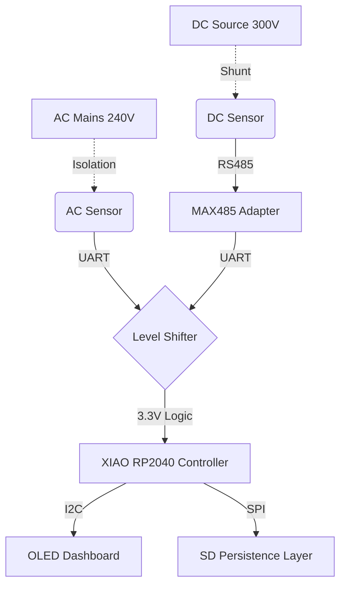

# VoltaMetric (Project Blueprint)

**VoltaMetric** is an embedded engineering initiative to build a dual-channel, high-precision power analyser using the **.NET nanoFramework**.

This project aims to bridge the gap between industrial sensing protocols (Modbus RTU) and modern Object-Oriented C# firmware. The device is designed to safely monitor Mains AC (240V) and High-Voltage DC (300V) simultaneously, logging telemetry to an onboard secure storage system.

---

## 🎯 Project Goals

1.  **Dual-Rail Physics:** Implement simultaneous sampling of AC Mains (via CT Coil) and DC High Voltage (via Shunt).
2.  **Protocol Bridging:** Create a C# implementation of the **Modbus RTU** protocol over RS485 to interface with industrial sensors.
3.  **Safety Isolation:** Design a hardware layer that optically isolates the microcontroller logic (3.3V) from the measurement rails (240V/300V).
4.  **Autonomous Logging:** Implement a file management system to persist time-series energy data to SD Card storage in NDJSON format.

---

## 🏗 Planned Architecture

### Hardware Stack
The system is built around the **Seeed Studio XIAO RP2040**, chosen for its dual-core Cortex M0+ processor and native support for .NET.

* **MCU:** Seeed XIAO RP2040 (C# / .NET nanoFramework)
* **AC Sensor:** PZEM-004T V3.0 (UART / Optical Isolation)
* **DC Sensor:** PZEM-017 (RS485 Modbus)
* **HMI:** 0.96" OLED Display (I2C)

### Logic Flow Diagram
The system uses a "Split-Stack" design to separate high-voltage physics from low-voltage logic.

## ⚠️ Safety Warning
### DANGER: High Voltage Project

This device interfaces directly with Mains Voltage (**110V**/**240V** AC) and High Voltage DC (>**60V**).

* **Risk of Electrocution**: Never touch the sensor modules or PCB while mains power is connected.

* **Enclosure**: The device must be mounted inside a non-conductive ABS plastic enclosure before use.

* **Isolation**: Ensure the Logic Level Shifter is correctly installed to maintain optical isolation between the High Voltage side and the USB/Logic side.

The author assumes no liability for injuries or damage caused by the assembly or use of this device.

## 📄 License
This project is licensed under the **MIT License** - see the **LICENSE** file for details.

Built with ❤️ and **C#** by **Arjun**
